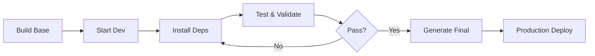

# Docker & Scripts Build Pattern Guide

> A comprehensive guide extracted from tennis_analysis project for building containerized ML/AI projects

## 🏗️ Architecture Overview

This project demonstrates a **multi-stage Docker build strategy** with **layered dependency management** and **comprehensive script automation**, designed specifically for complex machine learning projects.

## 📁 Project Structure

```
├── docker/
│   ├── Dockerfile.base          # Base image with system deps only
│   ├── Dockerfile.final         # Production image with frozen deps
│   ├── docker-compose.dev.yml   # Development environment
│   └── docker-compose.yml       # Production environment
├── scripts/
│   ├── build-base.sh           # Build base image
│   ├── build-final.sh          # Generate production image
│   ├── run-dev.sh              # Start development environment
│   ├── install-deps.sh         # Staged dependency installation
│   ├── test-env.sh             # Environment validation
│   └── download-models.sh      # Model management
├── requirements-base.txt        # Stable core dependencies
├── requirements-ml.txt          # ML framework dependencies
├── requirements-dev.txt         # Development tools
├── requirements-final.txt       # Frozen production dependencies
├── Dockerfile                  # Simple all-in-one version
└── start.sh                    # Interactive management interface
```

## 🐳 Docker Strategy

### Multi-Stage Build Pattern

#### 1. Base Image (Development)
```dockerfile
FROM python:3.8-slim
# Install only system dependencies
# Create non-root user
# Minimal setup for dependency testing
```

**Purpose**: Fast iteration, dependency validation, debugging

#### 2. Final Image (Production)
```dockerfile
FROM python:3.8-slim
# Install system dependencies
# Copy requirements-final.txt (generated from dev)
# Add health checks and security measures
```

**Purpose**: Stable production deployment, exact dependency versions

### Docker Compose Strategy

#### Development Environment
```yaml
tennis-dev:
  build: dockerfile: docker/Dockerfile.base
  volumes: ["../:/app"]  # Code mounting for development
  network_mode: host     # Easy debugging
  command: /bin/bash     # Interactive shell

tennis-jupyter:
  ports: ["8888:8888"]
  command: jupyter lab   # Data science workspace
```

#### Production Environment
```yaml
tennis-analysis:
  build: .
  volumes: ["./models:/app/models"]  # Data persistence
  environment: [PYTHONPATH=/app]
  command: python main.py
```

## 📦 Dependency Management

### Layered Requirements Strategy

```python
# requirements-base.txt - Core stable dependencies
numpy==1.21.0
opencv-python-headless==4.5.5.64
Pillow==8.4.0

# requirements-ml.txt - ML frameworks  
torch==1.12.1
torchvision==0.13.1
ultralytics==8.0.20

# requirements-dev.txt - Development tools
jupyter==1.0.0
jupyterlab==3.6.0

# requirements-final.txt - Frozen from working environment
# Generated by: pip freeze > requirements-final.txt
```

### Installation Flow
1. **Base deps** → 2. **ML deps** → 3. **Data deps** → 4. **Dev tools** → 5. **Freeze versions**

## 🚀 Script Automation

### Build Scripts
- `build-base.sh`: Quick base image for testing
- `build-final.sh`: Production image from validated dev environment
- `build.sh`: One-click build with environment checks

### Runtime Scripts  
- `run-dev.sh`: Development environment with X11 forwarding
- `run-main.sh`: Production application execution
- `run-notebook.sh`: Jupyter Lab service

### Utility Scripts
- `install-deps.sh`: Staged dependency installation with error handling
- `test-env.sh`: Comprehensive environment validation
- `download-models.sh`: Model file management

### Interactive Management
```bash
# start.sh - Menu-driven interface
1) Build base image (fast, system deps only)
2) Start development environment
3) Install and test dependencies  
4) Generate final production image
5) Run tennis analysis
6) Start Jupyter Lab
7) Download model files
8) Cleanup environment
```

## 🎯 Development Workflow



## 🔧 Key Patterns for Reuse

### 1. Environment Validation Pattern
```bash
# test-env.sh pattern
python3 -c "
try:
    import core_module
    print('✅ Core module - OK')
except ImportError as e:
    print(f'❌ Core module failed: {e}')
"
```

### 2. Staged Installation Pattern
```bash
# install-deps.sh pattern
for req_file in base ml data dev; do
    if pip install -r requirements-${req_file}.txt; then
        echo "✅ ${req_file} dependencies OK"
    else
        echo "❌ ${req_file} dependencies failed"
    fi
done
```

### 3. Health Check Pattern
```dockerfile
HEALTHCHECK --interval=30s --timeout=10s --start-period=30s --retries=3 \
    CMD python -c "import critical_modules; print('OK')" || exit 1
```

### 4. Security Pattern
```dockerfile
# Create non-root user
RUN useradd -m -u 1000 appuser && \
    chown -R appuser:appuser /app
USER appuser
```

## 📋 Implementation Checklist

### Phase 1: Foundation
- [ ] Create `docker/` and `scripts/` directories
- [ ] Write base Dockerfile with system dependencies
- [ ] Create layered requirements files
- [ ] Implement basic build scripts

### Phase 2: Development Environment  
- [ ] Configure docker-compose for development
- [ ] Create dependency installation script
- [ ] Add environment validation script
- [ ] Test development workflow

### Phase 3: Production Environment
- [ ] Implement production image generation
- [ ] Add health checks and security
- [ ] Create runtime scripts
- [ ] Test production deployment

### Phase 4: User Experience
- [ ] Create interactive management interface
- [ ] Add cleanup and maintenance scripts
- [ ] Write documentation and usage guides
- [ ] Performance optimization

## 🎨 Customization for Different Project Types

### Deep Learning Projects
```bash
# Add GPU support
runtime: nvidia
environment:
  - NVIDIA_VISIBLE_DEVICES=all
```

### Web Applications
```yaml
# Add web service configuration
ports: ["80:8000"]
depends_on: ["database"]
```

### Data Processing Projects
```yaml
# Add volume management for large datasets
volumes: 
  - "./data:/app/data:ro"
  - "./output:/app/output"
```

## 🚀 Benefits of This Pattern

1. **Reduced Setup Time**: New developers can start in minutes
2. **Consistent Environments**: Same setup across development and production
3. **Error Resilience**: Staged builds help isolate dependency issues
4. **Easy Debugging**: Base images allow step-by-step problem solving
5. **Scalable Architecture**: Can be extended for complex deployment scenarios

## 📊 Performance Optimizations

### Build Speed
- Layer caching strategy
- Separate dependency and code layers
- Multi-stage builds to reduce final image size

### Runtime Performance  
- Health checks for reliability
- Resource limits for stability
- Restart policies for resilience

---

This pattern has been successfully used in production ML projects and provides a solid foundation for containerizing complex AI/ML applications with minimal setup friction and maximum reliability.