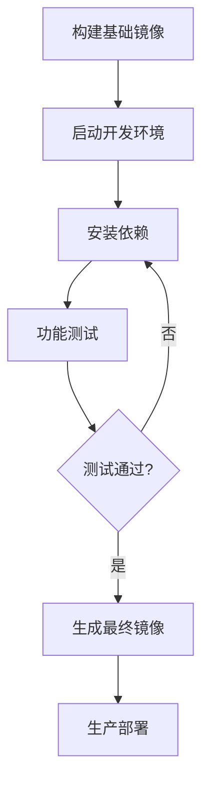

# Tennis Analysis项目Docker和Scripts构建思路总结

## 📋 项目概述

本文档总结了Tennis Analysis项目中Docker容器化和脚本自动化的设计思路和最佳实践，旨在为其他机器学习和AI项目提供可复制的构建模式。

## 🏗️ 整体架构设计

### 核心设计理念

1. **分阶段构建**: 降低构建失败风险，提高开发效率
2. **分层依赖管理**: 按功能模块分离依赖，便于维护和调试
3. **开发生产分离**: 不同环境使用不同的镜像和配置
4. **脚本化自动化**: 所有操作通过脚本执行，减少人为错误

## 🐳 Docker策略详解

### 1. 多阶段Docker镜像设计

#### 1.1 基础镜像 (`docker/Dockerfile.base`)
```dockerfile
# 特点：只包含系统依赖，不包含Python包
FROM python:3.8-slim
# 仅安装最基础的系统库
# 创建非root用户
# 暴露必要端口
```

**用途**:
- 快速构建测试环境
- 依赖验证和调试
- 开发阶段迭代

**优势**:
- 构建速度快
- 镜像体积小
- 便于调试依赖问题

#### 1.2 生产镜像 (`docker/Dockerfile.final`)
```dockerfile
# 特点：包含所有验证过的依赖
FROM python:3.8-slim
# 安装系统依赖
# 复制requirements-final.txt（从开发环境生成）
# 健康检查
# 用户权限设置
```

**用途**:
- 生产环境部署
- 最终交付
- 稳定运行

**优势**:
- 依赖确定性
- 健康检查机制
- 安全性考虑

#### 1.3 简化镜像 (`Dockerfile`)
```dockerfile
# 特点：一体化构建，适合快速上手
FROM python:3.8-slim
# 一次性安装所有依赖
# 适合演示和测试
```

### 2. Docker Compose策略

#### 2.1 开发环境 (`docker/docker-compose.dev.yml`)
```yaml
services:
  tennis-dev:    # 开发容器
    volumes:     # 代码目录挂载
    network_mode: host  # 便于调试
    tty: true    # 交互式终端
  
  tennis-jupyter: # Jupyter服务
    ports: 8888:8888
    command: jupyter lab
```

#### 2.2 生产环境 (`docker-compose.yml`)
```yaml
services:
  tennis-analysis:  # 主应用
    build: .
    volumes:         # 数据目录挂载
    environment:     # 环境变量
    
  tennis-notebook:  # 可选的notebook服务
    ports: 8888:8888
```

## 📦 依赖管理策略

### 分层依赖文件设计

#### 核心思想
将Python依赖按功能和稳定性分类，便于管理和问题排查。

```
requirements-base.txt    # 最稳定的核心依赖
requirements-ml.txt      # 机器学习框架
requirements-data.txt    # 数据处理库
requirements-dev.txt     # 开发工具
requirements-final.txt   # 最终冻结的依赖版本
```

#### 依赖安装流程
1. **基础依赖**: numpy, opencv, pillow等核心库
2. **ML依赖**: torch, ultralytics等深度学习框架
3. **数据依赖**: pandas, scikit-learn等数据处理
4. **开发依赖**: jupyter, gdown等开发工具

#### 版本管理策略
- **基础依赖**: 固定稳定版本
- **ML依赖**: 兼容版本范围
- **最终依赖**: pip freeze生成的确切版本

## 🚀 Scripts自动化体系

### 1. 构建脚本

#### 1.1 `scripts/build-base.sh`
```bash
# 构建基础镜像
# 快速验证系统依赖
# 为后续开发做准备
```

#### 1.2 `scripts/build-final.sh`
```bash
# 从开发环境生成生产镜像
# 导出requirements-final.txt
# 构建最终生产镜像
```

#### 1.3 `scripts/build.sh`
```bash
# 一键构建脚本
# 检查Docker环境
# 显示构建结果
```

### 2. 运行脚本

#### 2.1 `scripts/run-dev.sh`
```bash
# 启动开发环境
# 配置X11转发（GUI支持）
# 进入交互式容器
```

#### 2.2 `scripts/run-main.sh`
```bash
# 运行主程序
# 数据卷挂载
# 环境变量配置
```

### 3. 工具脚本

#### 3.1 `scripts/install-deps.sh`
```bash
# 分阶段安装依赖
# 错误处理机制
# 功能验证测试
```

#### 3.2 `scripts/test-env.sh`
```bash
# 环境验证脚本
# 依赖导入测试
# 功能模块检查
```

#### 3.3 `scripts/download-models.sh`
```bash
# 模型文件下载
# 版本检查
# 存储管理
```

### 4. 交互式管理 (`start.sh`)

提供菜单式操作界面：
```bash
1) 构建基础镜像
2) 启动开发环境  
3) 安装和测试依赖
4) 生成最终生产镜像
5) 运行网球分析
6) 启动Jupyter Lab
7) 下载模型文件
8) 清理环境
```

## 🎯 最佳实践模式

### 1. 开发流程



### 2. 错误处理策略

- **构建失败**: 分阶段定位问题
- **依赖冲突**: 分层安装，逐步验证
- **运行错误**: 详细日志和健康检查
- **环境不一致**: 冻结依赖版本

### 3. 安全考虑

- **非root用户**: 容器内使用普通用户
- **最小权限**: 只暴露必要端口和目录
- **依赖审查**: 定期更新和安全扫描
- **数据隔离**: 敏感数据通过卷挂载

## 📋 适用性指南

### 适合使用此模式的项目

✅ **推荐使用**:
- 机器学习/AI项目
- 依赖复杂的Python项目  
- 需要GPU支持的项目
- 多人协作的开发项目
- 需要部署到不同环境的项目

### 实施步骤

#### 第一阶段：基础设施
1. 创建目录结构：`docker/`, `scripts/`
2. 编写基础Dockerfile
3. 创建分层requirements文件
4. 实现基础构建脚本

#### 第二阶段：开发环境
1. 配置docker-compose开发环境
2. 实现依赖安装脚本
3. 添加环境验证脚本
4. 测试开发流程

#### 第三阶段：生产环境
1. 实现生产镜像构建
2. 配置健康检查
3. 添加运行脚本
4. 集成CI/CD

#### 第四阶段：完善工具
1. 实现交互式管理界面
2. 添加清理和维护脚本
3. 完善文档和使用指南
4. 性能优化

## 🔧 定制化建议

### 针对不同项目类型的调整

#### 深度学习项目
- 添加CUDA支持
- GPU资源管理
- 大型模型下载策略
- 训练/推理环境分离

#### Web应用项目
- 端口映射策略
- 负载均衡配置
- 数据库连接管理
- 静态资源处理

#### 数据处理项目
- 大数据卷挂载
- 内存使用优化
- 并行处理配置
- 结果输出管理

## 📊 性能优化建议

### 1. 镜像体积优化
- 多阶段构建减少层数
- 清理apt缓存和临时文件
- 使用.dockerignore排除无关文件
- 选择合适的基础镜像

### 2. 构建速度优化
- 利用Docker构建缓存
- 依赖层与代码层分离
- 并行构建多个镜像
- 预构建基础镜像

### 3. 运行性能优化
- 合理设置资源限制
- 使用健康检查机制
- 配置重启策略
- 监控容器状态

## 🎉 总结

这套Docker和Scripts构建体系的核心价值在于：

1. **降低门槛**: 新开发者可以快速上手
2. **提高效率**: 自动化减少重复工作
3. **确保一致性**: 统一的环境和部署流程
4. **便于维护**: 模块化设计易于调试和扩展
5. **安全可靠**: 完善的错误处理和安全机制

通过采用这种模式，其他项目可以快速建立起稳定、高效的容器化开发和部署流程。